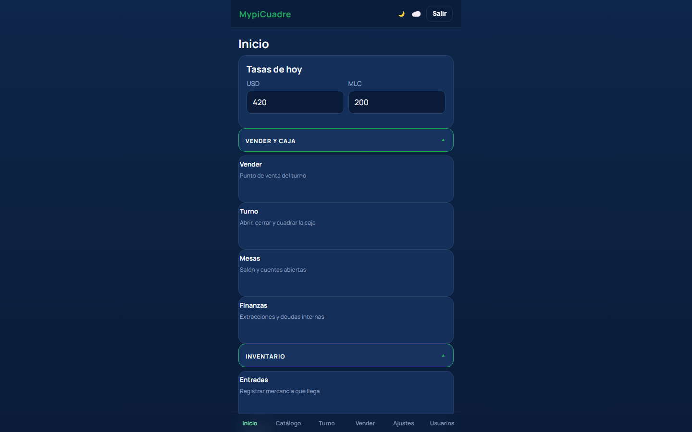
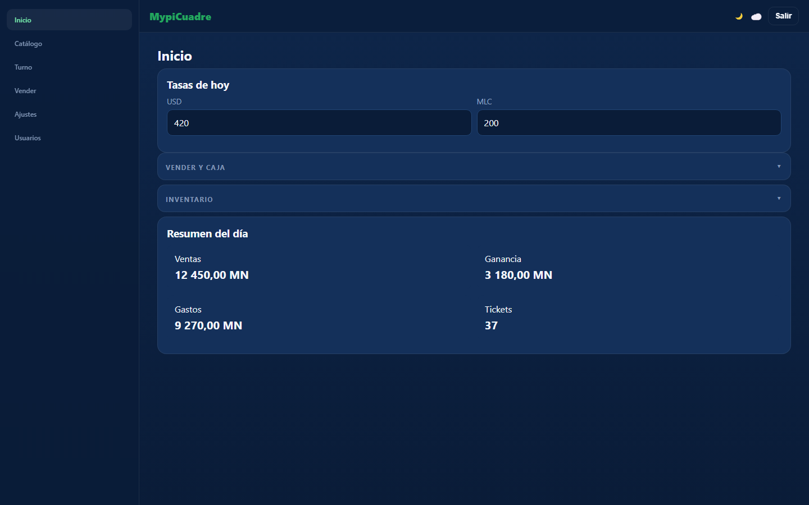
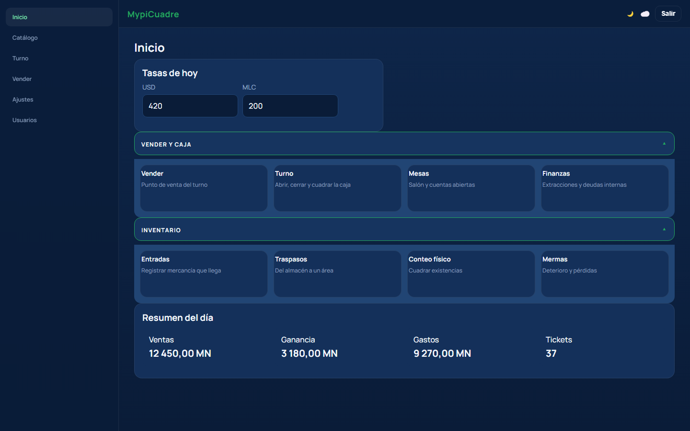
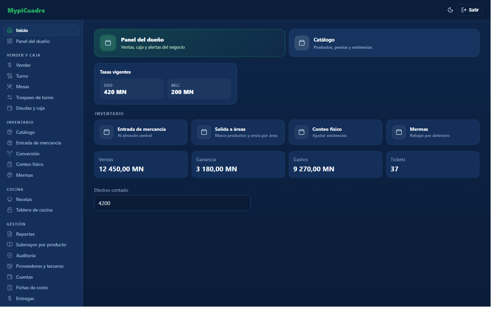
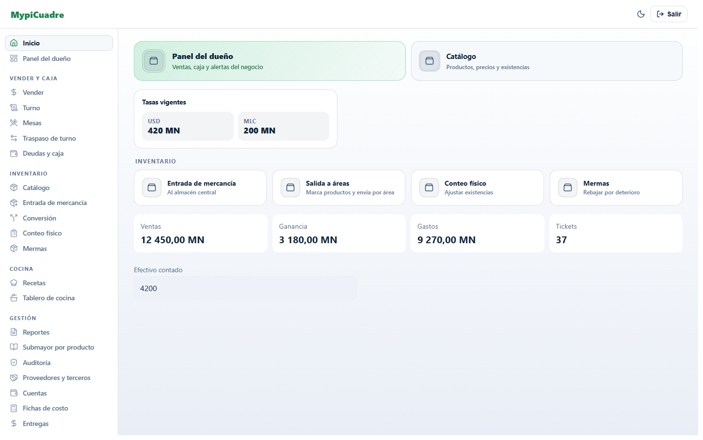

# Vista de escritorio — plan validado (16-09-2026)

**Estado: F1 + F2 EJECUTADAS el 16-09-2026.** La validación del plan contra el código —con las
**cinco correcciones** que hubo que hacerle— está en el **§11**, y el acta de ejecución en el **§12**.

Los **§1 a §10 se dejan tal cual**: son el plan como se aprobó, y sirven de contraste con lo que la
validación encontró después. Donde el §2 dice «dos líneas» son cuatro, donde dice «38 pantallas»
son 40, y la referencia visual del §5.3 **no se aprobó** — todo eso está razonado en el §11.
Lo que aquí se afirma está **medido o capturado**, y lo que no se pudo comprobar está en el §9 y,
puesto al día, en el §12.6.

---

## 1. El problema, en una frase

En la computadora la aplicación se ve **igual que en el teléfono**: una columna estrecha centrada,
sea cual sea el monitor. El resto de la pantalla se desperdicia.



*Captura real del armazón de la app con su CSS de hoy, a 1440 px. Las tarjetas se apilan de una en
una y sobran ~950 px a los lados.*

## 2. De dónde sale, medido

El corsé son **dos líneas** de `src/styles/global.css`:

| Dónde | Qué hace |
|---|---|
| `#root { max-width: 480px }` (**:147**) | limita TODA la aplicación al ancho de un móvil |
| `.app-nav { max-width: 480px }` (**:228**) | ancla la barra de navegación a ese mismo ancho |

Y el estado general del CSS:

- **3.462 líneas**, con solo **5 `@media`**: dos de `max-width: 380px`, una de impresión y una de
  `prefers-reduced-motion`. **La aplicación no tiene diseño adaptable**: es móvil fijo.
- **38 pantallas** usan la clase `.screen` (tope de 560 px, que hoy nunca se alcanza).
- Otros topes: `.modal` 560 px, `.auth-card` 380 px (el login: **no debe ensancharse**).
- **18 rejillas**: 5 con columnas fijas pensadas para 480 px (`.pinpad__keys`, `.convert-grid`,
  `.denom__grid`, `.kpi-grid`, `.salon-summary`) y 5 que ya se adaptan solas (`auto-fill`).
- **5 elementos `position: fixed`**: la barra de navegación, los fondos de los modales, los dos
  desplegables (sincronización y avisos) y la **barra de cobro** (`.pay-bar`).

## 3. Lo que decidió el dueño

1. **Menú lateral + contenido ancho** (aspecto de aplicación de escritorio).
2. **Tope cómodo de ~1.400 px**, centrado, para que nada quede estirado.
3. **Se usa toda la aplicación en la computadora**, no un subconjunto.

## 4. La estrategia, y por qué es segura

**Todo el cambio cabe en CSS.** Lo verifiqué: **ningún componente mide la ventana** — cero
`innerWidth`, cero `matchMedia`, cero `ResizeObserver` en todo `src/`. El armazón que hay que
reorganizar (`app-shell > header + aviso de licencia + main + nav`) se convierte en una rejilla con
áreas nombradas, y eso **no necesita tocar el JSX**.

Y todo va dentro de:

```css
@media screen and (min-width: 1024px) { … }
```

- **`min-width`** → por debajo de 1024 px **no existe ni una regla nueva**. El teléfono no ve un CSS
  distinto: ve **el mismo**.
- **`screen`** → nunca aplica al imprimir, así que el **ticket térmico de 58 mm** queda intacto por
  construcción, no por suerte.
- El cambio es **puramente aditivo**: no se modifica ninguna regla existente, se añaden reglas que
  solo viven dentro del media query.

## 5. Lo validado, con evidencia

### 5.1 El teléfono no cambia — **píxel a píxel**

Monté el armazón real con el `global.css` real y las reglas propuestas, y lo capturé con Chrome a
**390 px** (ancho de teléfono, dentro de un iframe: `--window-size` **miente** en Windows) **con** y
**sin** el CSS nuevo:

```
telefono 390px, con el CSS nuevo vs sin el   ->  PIXEL A PIXEL IDENTICAS
control negativo (breakpoint bajado a 320px) ->  DIFIEREN en 14,37 % de los pixeles
```

El **control negativo** es lo que hace válida la prueba: sin él, una comparación que no mide nada
también saldría "idéntica".

**Cautela metodológica que costó descubrir:** las dos primeras capturas del control **diferían entre
sí un 5,2 %** — la misma página capturada dos veces. La captura no era determinista hasta añadir
`--virtual-time-budget=4000` y `--force-device-scale-factor=1`. Sin eso, cualquier conclusión de
"se ve igual" habría sido ruido.

### 5.2 Soltar el ancho NO basta — y esto es el hallazgo principal

Primera versión, solo quitando el corsé y poniendo el lateral:



Sale exactamente lo que el dueño teme: **campos de 540 px para escribir «420»**, indicadores
separados por medio monitor y tarjetas de 1.130 px con dos datos dentro. **Ensanchar sin recomponer
produce una pantalla peor que la de hoy.**

### 5.3 Con composición, el resultado es defendible



Tercera iteración: tarjetas de acción en cuatro columnas dentro de su acordeón, indicadores en
cuatro columnas, campos acotados, tarjeta de tasas ajustada a su contenido. **Esta captura es la
referencia visual a aprobar**, no el final: es una maqueta del Inicio, y quedan 37 pantallas.

## 6. Qué hay que tocar, en concreto

| Grupo | Elementos | Trabajo |
|---|---|---|
| **Armazón** | `#root`, `.app-shell`, `.app-header`, `.app-main`, `.app-nav`, `.nav-item` | rejilla de dos columnas y navegación vertical |
| **Anchos** | `.screen` (38 pantallas), `.modal` | tope de 1.400 px; los modales **caso por caso** |
| **No se tocan** | `.auth-card` (login), `.pinpad__keys` (teclado), `.thermal` (ticket) | ensancharlos los **empeora** |
| **Rejillas fijas** | `.kpi-grid`, `.rates-grid`, `.denom__grid`, `.convert-grid`, `.salon-summary` | número de columnas según el ancho |
| **Rejillas ya adaptables** | `.salon-grid`, `.menu-grid`, `.kitchen-grid` | revisar el tamaño mínimo de celda |
| **Fijos** | `.pay-bar` (barra de cobro), fondos de modales y desplegables | deben respetar la columna lateral |
| **Campos** | `.field input/select/textarea` | tope de ancho: un número no necesita 1.100 px |

## 7. Fases propuestas

Cada fase es **independiente y desplegable por sí sola**. Si una no convence, se revierte sin tocar
las demás.

- **F1 — Armazón.** El media query, la rejilla, la navegación lateral y el tope de `.screen`.
  Es el cambio estructural; **una sola vez y sirve a las 38 pantallas**.
- **F2 — Composición base.** Las rejillas compartidas, el tope de los campos y el panel del
  acordeón. Es lo que separa el §5.2 del §5.3, y también es transversal.
- **F3 en adelante — Pantalla por pantalla, por orden de uso en la computadora.** Propuesto:
  (a) Inicio y panel del dueño · (b) Reportes y auditoría · (c) Catálogo, productos y recetas ·
  (d) Inventario: entradas, traspasos, conteo, mermas · (e) Ventas y mesas · (f) Ajustes, usuarios,
  entregas y fichas.
- **F4 — Tabletas (768–1023 px), opcional.** Un paso intermedio: contenido más ancho con la
  navegación todavía abajo. **No se ha validado** y puede decidirse después.

**Cada fase se valida igual:** captura a 390 px comparada píxel a píxel contra la anterior (debe ser
**idéntica**) + captura a 1440 px para revisión visual + `npm run build` + las 15 suites.

## 8. Lo que este plan NO propone

- **No toca ni una línea de lógica**, ni repositorios, ni esquema Dexie, ni sincronización.
- **No cambia el JSX** en F1 y F2. Si más adelante se quisieran **más entradas en el menú lateral**
  (hoy tendría las mismas 6 que la barra inferior), eso **sí** tocaría `Layout.jsx` y sería una
  decisión aparte.
- **No toca el móvil.** Ni un píxel, y está demostrado en el §5.1.
- **No rediseña** colores, tipografía ni componentes: es una cuestión de **espacio y composición**.

## 9. Lo que no se puede garantizar

- **Nadie ha visto la aplicación real en escritorio.** Todo lo capturado es una **maqueta**: el CSS
  es el real y las clases son las reales, pero el contenido es representativo y **el render viene de
  un HTML escrito a mano, no de React**. La app no se puede abrir aquí para verla (`router.jsx`
  exige licencia firmada, usuarios en IndexedDB y sesión).
- **Solo se validó el Inicio.** Quedan 37 pantallas, y algunas —reportes con tablas anchas, el punto
  de venta con su barra de cobro fija, el salón de mesas— tienen composiciones propias que pueden
  pedir decisiones que aquí no están tomadas.
- **El breakpoint de 1024 px es una propuesta**, no una medición: sale de que el lateral (248 px)
  más un contenido cómodo (~700 px) necesitan aproximadamente eso. Una tableta en horizontal caería
  del lado de escritorio; si eso no gusta, se sube el umbral.
- **Dos defectos de accesibilidad preexistentes** siguen ahí y este plan no los toca:
  `.btn--sm` mide ~34 px (por debajo de los 44 recomendados) y `.badge--bad` da 3,72:1 de contraste.
  Están en `main` desde antes.

## 10. Coste y reversibilidad

- **Peso:** solo CSS. La estimación es de **2 a 4 kB** sobre el fichero de estilos (hoy 81,5 kB);
  se medirá en cada fase.
- **Reversible:** quitar el bloque `@media` devuelve la aplicación exactamente a como está hoy. No
  hay migración, ni dato nuevo, ni nada que deshacer en la base.
- **Convivencia:** no aplica. No cambia ningún dato ni formato, así que un teléfono sin actualizar y
  otro actualizado se entienden exactamente igual que hoy.

---

**Aprobado y ejecutado.** El acta de la validación y de F1+F2 está en los §11 y §12, más abajo.
**Lo siguiente es F3**: pantalla por pantalla, por orden de uso en la computadora.

---

## 11. Validación del plan contra el código (16-09-2026)

Antes de escribir una línea se contrastó **cada afirmación del §1 al §6 contra el repositorio**.
Todo lo de abajo está **medido**, no leído.

### 11.1 Lo que el plan afirmaba y es exacto

`#root{max-width:480px}` en **:147** y `.app-nav` en **:228** · **3.462** líneas de CSS ·
`.screen` 560 (**:258**), `.modal` 560 (**:629**), `.auth-card` 380 (**:291**) · **18** rejillas,
**5** con `auto-fill` y las 5 de columnas fijas citadas · y —la clave de toda la estrategia—
**ningún componente mide la ventana**: cero `innerWidth`, `matchMedia`, `ResizeObserver`,
`clientWidth` y `offsetWidth` en todo `src/` (se comprobaron los cinco, el plan citaba tres).
El armazón es `.app-shell` en columna con `header + aviso + main + nav` como **hermanos**, así que
la rejilla no necesita tocar el JSX: confirmado.

### 11.2 Lo que el plan NO decía, y se corrigió antes de programar

1. **`.screen` lo usan 40 ficheros, no 38.** Los dos extra son `router.jsx` (pantalla de carga) y
   `ErrorBoundary.jsx`. Subir `.screen` a 1.400 px alcanza también a **login, onboarding,
   activación y error**; esos se salvan porque van con `.screen--centered` + `.auth-card` (380 px),
   pero **`OtherShiftBlocked.jsx` usa `.screen` pelado** con dos frases dentro y quedaría en una
   tarjeta de 1.400 px. Por eso el bloque trae `.screen--centered { max-width: none }` y una
   **medida de lectura de 72ch** para la prosa.
2. **El corsé de 480 px está en CUATRO sitios, no en dos.** Además de `:147` y `:228`:
   `.pay-bar` (**:3090**, que el §6 sí listaba) y **`.salon-menu` (:3137), que no aparecía en el
   plan**. Se decide dejar `.salon-menu` como está: es un menú de acciones y ensancharlo lo
   empeora — pero queda **dicho**, no omitido.
3. **Los dos desplegables NO son `position: fixed`**: solo sus fondos lo son; los paneles son
   `position: absolute` anclados a `.app-header`. Como la cabecera cruza entera, **siguen cayendo
   donde deben sin tocar nada**. Esto quita trabajo del §6.
4. **`.nav-item` no tiene `:hover` ni `:focus-visible`** — solo cambia de color en `.active`. En un
   ratón eso es un defecto propio del escritorio que el plan no contemplaba.
5. §2 dice «solo 5 `@media`» y enumera 4. La quinta coincidencia del `grep` es un comentario.

### 11.3 La referencia visual del §5.3 NO se aprobó

El §9 admite que el render es HTML escrito a mano, pero el §5.3 pedía aprobar esa captura como
**referencia visual**. No coincide con los componentes reales:

- El `ActionCard` real **lleva icono** (`.action-tile`, `Home.jsx:108`) **y contador**; la maqueta
  no tiene ninguno de los dos.
- La tarjeta de tasas real se titula **«Tasas vigentes»** y muestra celdas de **solo lectura**;
  la maqueta dice «Tasas de hoy» y pinta **dos campos de entrada**.
- La barra lateral de la maqueta **no tiene iconos**; los `NavLink` reales sí.

Y como diseño repetía el defecto del §5.2: cabeceras de acordeón de 1.130 px con el chevron a
1.100 px de su etiqueta, tarjetas de título + subtítulo sin estado, y dos anchos arbitrarios
(520 y 1.130) sin sistema. **Se descartó y se rehizo.**

---

## 12. F1 + F2 EJECUTADAS (16-09-2026)

Se ejecutaron **juntas** a propósito: el §5.2 demuestra que el armazón **sin** composición da una
pantalla peor que la de hoy, así que desplegar F1 sola sería empeorar la app a medias.

### 12.1 Tres decisiones del dueño, tomadas antes de programar

1. **Barra lateral con navegación real**, no las 6 entradas de la barra inferior. Un lateral de
   248 px con seis enlaces al lado de un Inicio con ~41 es relleno.
2. **Las tarjetas de acción se recomponen con CSS**, sin tocar el JSX: el marcado real ya trae
   icono, contador, título y subtítulo.
3. **Movimiento:** estados de puntero + entrada de pantalla al cambiar de ruta.

### 12.2 Qué se escribió

| Fichero | Qué |
|---|---|
| `src/lib/navSections.js` (nuevo, 224 líneas) | **Módulo PURO** que decide qué entradas lleva la barra. Sin React, sin Dexie y sin lucide. |
| `src/lib/navSections.test.mjs` (nuevo, 204 líneas) | Suite **16ª**: **277 aserciones**. |
| `src/components/Layout.jsx` | **+118 / −3**. Las 3 bajas son la línea de `import` de lucide, la del `useAuth` y la de `<nav>`: **sustituciones en el sitio, nada eliminado**. |
| `src/styles/global.css` | **+246 / −0**. **Cero borrados: estrictamente aditivo.** |

**Por qué el inventario es un módulo puro y no condicionales dentro del JSX:** la barra inferior
tiene 6 entradas y sus puertas caben de un vistazo; la lateral pasa de veinte, y ahí es donde nace
una fuga de licencia. Con la decisión en una función pura, **la fuga se caza en la suite y no en
producción**. La suite comprueba, entre otras cosas: sin licencia **ninguna** de las rutas de
módulo aparece para **ninguno** de los cuatro roles; con **un solo** módulo comprado salen las
suyas y **no las de los otros nueve** (esto caza la puerta copiada y pegada mal); y **ningún grupo
queda vacío**, porque un título «GESTIÓN» sobre la nada delata el módulo aunque no haya nada
clicable. Lleva **control negativo**: sin él, todas esas aserciones pasarían aunque la función
devolviera siempre una lista vacía.

**La única regla fuera del `@media`** es `.app-side { display: none }`. La barra se monta siempre y
el CSS la oculta, en vez de preguntar el ancho desde JavaScript: así se **conserva la propiedad del
§4** —ningún componente mide la ventana— que es la que permite afirmar que el móvil no puede
cambiar de comportamiento. `display:none` además la saca del orden de tabulación y del árbol de
accesibilidad: en el teléfono no existe ni para un lector de pantalla.

**Coste de montarla en todas las pantallas:** **una** consulta viva a `config` (la tabla más
pequeña) en lugar de cinco, y el contador de entregas por cobrar **gateado en la consulta**, no
solo en el render — sin el módulo `remesas` no se toca `remittances`. Solo LEE: la barra no
escribe nada.

### 12.3 El movimiento

**Uno solo y autoral**, no efectos sueltos: al cambiar de pantalla, el contenido entra
(`desk-screen-in`, 280 ms). React monta un elemento nuevo por ruta, así que se dispara sin que
ningún componente escuche la navegación. **Continúa el idioma que la app ya tenía** —la misma curva
`cubic-bezier(0.22, 1, 0.36, 1)` y la misma duración del acordeón— en vez de inventar otro. Lo
demás son **estados**, no animaciones: hover y foco en la lateral y en las tarjetas, que en un
móvil no existen y que con ratón son la diferencia entre una tarjeta clicable y un rectángulo.
Todo se apaga con `prefers-reduced-motion`.

### 12.4 Cómo quedó



*El armazón real (`Layout.jsx`) con el CSS real, a 1440 px. Barra lateral con las secciones del
negocio, tarjetas de acción con el icono al lado del texto, resumen alineado con las tarjetas de
arriba y el campo acotado. Los iconos de la zona derecha son un marcador del arnés; en la app son
los de lucide que ya usa el Inicio.*



*El mismo armazón en tema claro, que es donde estaban los números de contraste bajos.*

### 12.5 Verificación ejecutada

**El teléfono no cambia: BYTE A BYTE.** Y esta vez no con un HTML escrito a mano, sino montando el
**`Layout` real** (el componente, con el CSS real) en un arnés con los cuatro proveedores
sustituidos por stubs, compilado con Vite y capturado con Edge headless a 390 px dentro de un
iframe (`--window-size` **miente** en Windows) con `--virtual-time-budget=5000` y
`--force-device-scale-factor=1`:

```
telefono 390px:  HEAD (425c88a)  vs  rama con el cambio   -> SHA256 IDENTICO
la misma pagina capturada dos veces                       -> SHA256 IDENTICO (determinista)
CONTROL NEGATIVO (umbral bajado de 1024 a 320 px)         -> SHA256 DISTINTO
```

El **control negativo** es lo que hace válida la prueba. Y la primera tanda de capturas salió **en
blanco** —`file://` bloquea los módulos ES— con los tres ficheros del **mismo tamaño**: sin
abrirlos, «idénticas» habría sido una mentira perfecta. Por eso se sirvieron por HTTP y se miraron.

**Dos defectos propios, encontrados midiendo y corregidos:**

1. **Contraste en tema claro.** `--text-3` sobre el blanco de la lateral da **4,47:1**, por debajo
   del 4,5 exigido. Se cambió a `--muted`: **5,36** en oscuro y **5,14** en claro. (El primer
   cálculo usó los valores del tema oscuro y daba números falsos: el tema claro **sí** redefine
   `--accent-light` y `--primary-600` a `#17864a`. Con los valores correctos, los siete pares
   medidos pasan en los dos temas.)
2. **`auto-fill` en `.kpi-grid`** dejaba una pista vacía de reserva y el borde derecho del resumen
   no cuadraba con el de las tarjetas de arriba. Se pasó a `auto-fit`. En `.home-grid` se deja
   `auto-fill` **a propósito**: ahí son fichas, y dos fichas estiradas a 1.100 px serían peor que
   un hueco al final.

**Lo demás:** `npm run build` **exit 0** · **16 suites / 1.171 aserciones** en verde (las 15 de
siempre, sin tocar, más las 277 nuevas) · detector de la skill de diseño sobre los dos ficheros
tocados: **0 hallazgos en lo escrito** (los 5 que salen —cuatro `border-left` de 3-4 px y un
`transition: width`— son **preexistentes en `main`** y no se tocan, porque el cambio es aditivo).

**Peso:** CSS 81,52 → **84,92 kB** (+3,40; gzip +0,69). Chunk principal 990,50 → **999,33 kB**
(+8,83; gzip 288,01 → **290,85**, +2,84). En conjunto **+3,53 kB gzip (+1,2 %)**. Como el chunk
lleva hash, **actualizar cuesta la descarga completa (~291 kB gzip por teléfono)**, no el delta.

### 12.6 Lo que NO se puede garantizar

- **NADIE HA EJECUTADO LA APP.** Ni un clic en la barra lateral desde una computadora real. Lo
  capturado es el **`Layout` real** con el **CSS real**, pero los proveedores son stubs, el
  contenido de la zona derecha es representativo y los iconos del arnés son un marcador; la app no
  se puede abrir aquí (`router.jsx` exige licencia firmada, usuarios en IndexedDB y sesión).
- **Solo se compuso el Inicio.** Las **37 pantallas restantes** heredan el armazón, el tope de
  ancho, la medida de lectura y el tope de los campos —que es lo transversal—, pero **no están
  revisadas una a una**. Las que tienen composición propia (reportes con tablas anchas, el punto de
  venta, el salón de mesas) siguen pendientes: eso es la F3.
- **`.modal` (560 px) no se tocó.** En escritorio se ve estrecho pero correcto; ensancharlo es una
  decisión caso por caso, como dice el §6.
- **El umbral de 1.024 px sigue siendo una propuesta**, no una medición. Una tableta en horizontal
  cae del lado de escritorio.
- **Los dos defectos preexistentes del §9 siguen ahí** (`.btn--sm` ~34 px y `.badge--bad` 3,72:1).
  La barra lateral **no** hereda el primero: sus filas miden 34 px pero son **solo de puntero**
  (por debajo de 1.024 px no existen), y el criterio de 44 px es de **toque**.
- **Convivencia de versiones: ninguna.** Sin esquema, sin dato nuevo, sin formato nuevo y sin una
  sola escritura a la base. Un teléfono actualizado y otro sin actualizar intercambian exactamente
  lo mismo que hoy. Quitar el bloque `@media` y el componente `SideNav` devuelve la app a como
  estaba.

### 12.7 Repaso independiente del 17-09-2026 — un coste no documentado

Se volvió a auditar el commit `5753a37` **sin dar por buena el acta anterior**. Todo lo que el
§12.5 afirma se sostiene, y se comprobó por separado:

- **El CSS es puramente aditivo:** `+246 / -0`. Solo dos bloques `@media`, los dos
  `min-width: 1024px`. De las 18 líneas nuevas que caen fuera, **17 son comentarios** y la única
  regla real es `.app-side { display: none }` — verificado contando llaves, no leyendo. Las reglas
  que **muestran** la barra lateral (`:3520` en adelante) están **dentro** del media query.
- **La barra inferior del teléfono es idéntica carácter por carácter** a la de `425c88a`, salvo el
  `aria-label` añadido (invisible). Se extrajo el bloque `<nav className="app-nav">` de las dos
  versiones y se comparó: quitando solo ese atributo, **coinciden exactamente**.
- **Build exit 0 · 16 suites / 1.171 aserciones, 0 fallos** (comprobado por *código de salida*:
  `navSections.test.mjs` imprime «0 fallos» y no «0 fail», así que un recuento por texto la da por
  rota sin estarlo).

**Lo que el acta NO decía, y hay que saber:** el `Layout` ganó **dos `useLiveQuery` que antes no
existían**, y el `Layout` corre para **todos los roles, también en el teléfono**, aunque la barra
lateral esté oculta — React no sabe nada del CSS y `SideNav` se monta igual.

| Consulta nueva | Qué cuesta | Para quién |
|---|---|---|
| `navCfg` | **6 lecturas de `config` por clave primaria** (`getAreas` 1, `getElaboration` 2, más 3 sueltas) | **todos los roles** |
| `remittances` | `db.remittances.toArray()` — **tabla completa** | solo **mando con el módulo `remesas`** (si no, `Promise.resolve([])`, que no consulta) |

**Su tamaño real, medido y no supuesto:** el `Layout` **envuelve las `Routes`** (`router.jsx:66`),
así que **se monta una sola vez por sesión**, no en cada pantalla. Las consultas se repiten solo
cuando `useLiveQuery` detecta un cambio en las tablas que observa (`config`, que casi nunca cambia,
y `remittances`). Y un re-render del `Layout` **no** arrastra a las pantallas: `children` es el
mismo elemento de React y no se vuelve a renderizar.

**Veredicto:** el coste es **marginal** —lecturas locales de IndexedDB, una vez por sesión— pero
**no es cero**, y el acta del §12.5 decía «sin una sola escritura a la base» sin mencionar que sí
hay **lecturas nuevas**. Visualmente el teléfono es idéntico (probado byte a byte); funcionalmente
hace un poco más de trabajo al arrancar. Si alguna vez molesta, la salida es montar `SideNav` solo
por encima de 1.024 px con `matchMedia` — a cambio de que React pase a depender del ancho de la
ventana, que hoy **no ocurre en ninguna parte de la app** y es lo que hace todo esto tan barato de
revertir. **No se cambia ahora**: queda anotado como decisión del dueño.

---

## 13. F3a EJECUTADA — el Inicio deja de ser un segundo menú (17-09-2026)

Nace de una **captura del monitor del dueño**, no de una maqueta. Lo que se veía: ocho cabeceras de
acordeón cruzando la pantalla entera, el chevron a ~1.700 px de su etiqueta, el botón *Abrir* al
extremo opuesto del texto que lo explica, y media pantalla vacía.

### 13.1 El diagnóstico, medido

| Defecto | Evidencia |
|---|---|
| El contenido llega al borde | **`Home.jsx` es la ÚNICA de las 35 pantallas sin `.screen`**, así que nunca heredó el tope de 1.400 px |
| Dos menús para lo mismo | la barra lateral trae **29 entradas en 7 grupos** y el Inicio repetía las mismas secciones |
| Cabeceras de 1.800 px | consecuencia del primer punto |
| Destacados descuadrados | `.home-highlights` era una pila flexible: «Panel del dueño» salía del doble de ancho que «Catálogo» |

### 13.2 La decisión del dueño

**El Inicio es un panel de estado, no un menú.** En escritorio se ocultan sus acordeones de
navegación —para eso está la barra lateral— y queda el estado: avisos, turno, accesos destacados y
tasas. **En el teléfono no cambia nada**, porque allí no hay barra lateral y los acordeones son la
única forma de navegar.

### 13.3 Lo que se escribió, y un gancho que evitó un destrozo

Cinco reglas, **todas dentro del `@media screen and (min-width: 1024px)` que ya existía**. Cero JSX,
cero lógica, cero consultas.

**El gancho es `.home .acc`, y no `.home-section` ni `.acc` a secas.** Ese mismo componente
`Accordion` lo usan **Reportes y Ajustes**: una regla suelta les habría **vaciado la pantalla**. Se
comprobó leyendo el componente antes de escribir la regla, no después.

Y una corrección propia tras ver la primera captura: acotar solo los avisos dejaba la página
**escalonada** (avisos a 480 px, destacados estirados a 1.350). Se pasó a una **columna de trabajo
coherente** de 880 px con los destacados en dos columnas iguales. El hueco de la derecha **no se
rellena por rellenar**: es el sitio de las cifras del día, cuando se aprueben.

### 13.4 Verificación ejecutada

```
telefono 390px: con F3a vs sin F3a          -> PIXEL A PIXEL IDENTICAS
la misma pagina capturada dos veces         -> PIXEL A PIXEL IDENTICAS (determinista)
CONTROL NEGATIVO (umbral bajado a 320 px)   -> DIFIEREN en 30,64 % de los pixeles
```

Las cinco reglas nuevas verificadas **dentro** del media query contando llaves, no leyendo.
`npm run build` **exit 0** · **16 suites / 1.171 aserciones**, 0 fallos (por código de salida) ·
CSS 84,92 → **85,25 kB** (+0,33).

Antes y después en `img/escritorio-f3a-antes.png` y `img/escritorio-f3a-inicio.png`.

### 13.5 Lo que NO se hizo, y por qué

**Las cifras de ventas y ganancia del día.** El dueño las pidió, pero **el Inicio no tiene ese dato**
(no consulta ventas en absoluto) y traerlo **es lógica, no diseño**: correría también en el teléfono,
porque es la misma pantalla. `analyticsRepo.report` hace `db.sales.toArray()` —todas las ventas, 713
en un mes en el respaldo real— y `useLiveQuery` lo recalcularía con cada venta que baje por
sincronización. **Hay vía barata** (índice `createdAt` en `sales`, acotado al día, gateado a mando;
el patrón ya existe en `notificationService.js:514`), pero se deja como **decisión aparte**: meterla
dentro de un cambio visual habría roto la regla de «solo escritorio». Mientras tanto, «Panel del
dueño» queda destacado y esas cifras están a un clic.

### 13.6 Sigue sin poder garantizarse

- **Nadie ha abierto la app.** La captura de validación es una **maqueta**: el CSS es el real y las
  clases son las reales, pero el markup está escrito a mano. La app no se puede abrir aquí.
- **Solo se compuso el Inicio.** Las 34 pantallas con `.screen` siguen sin revisar una a una; las de
  composición propia (reportes con tablas anchas, punto de venta, salón) son la F3b en adelante.

---

## 14. Paso 1 del panel — exprimir lo que ya estaba cargado (17-09-2026)

**Reconocimiento previo:** F3a (§13) fue **medio paso**. Quitó los acordeones y dejó para «después»
lo que iba a ocupar su sitio, y el resultado —cuatro cajas en la esquina de un monitor de 1.800 px—
era **peor** que el punto de partida. Un panel de estado sin datos de estado es una pantalla vacía.

### 14.1 Lo que se verificó antes de escribir nada

De los tres datos que se ofrecieron como «coste cero», **solo dos lo eran**:

| Dato | ¿Gratis? | Comprobación |
|---|---|---|
| Turno: área y hora de apertura | **sí** | `ShiftProvider` ya expone `activeShift` entero |
| Entregas por cobrar | **sí** | `pendingCollection` ya se calcula en `Home.jsx:221` |
| Conteos esperando aprobación | **NO** | el Inicio no consulta eso; sería una consulta nueva |

El tercero **se retiró del paso**. Estaba mal ofrecido.

### 14.2 Lo que se hizo

- **`lib/dates.js` gana `timeLabel(iso)`** (pura, con 7 aserciones nuevas): la hora sin la fecha.
  No se recorta la cadena de `formatDateTime` —recortar por posición se rompe en cuanto cambie el
  formato— y usa la **misma configuración regional**, para que las dos impriman la hora igual.
- **El banner de turno dice desde cuándo**: `Tienda · abierto desde las 08:14`. El dato ya viajaba
  en el contexto; solo faltaba pintarlo.
- **Un solo ancho** para las piezas del panel. `fit-content` las ataba a su propio texto y salían
  **tres anchos distintos en la misma columna** (404, 510 y 510 px en la captura del dueño): eso se
  lee como descuadre, no como ritmo.
- El markup nuevo va en **`.desk-only`**, que es `display:none` fuera del media query: **en el
  teléfono no se pinta**, igual que `.app-side`.

### 14.3 La verificación falló, y hubo que cambiar de método

La comparación de **píxeles** dio `0,032 %` de diferencia en el teléfono. Antes de reportarlo como
hallazgo o descartarlo, se hizo el control: **la misma página capturada tres veces difiere entre sí
en 0,030 % y 0,034 %**. Es decir, **la diferencia medida estaba por debajo del ruido del propio
método**: no demostraba ni que hubiera cambio ni que no lo hubiera. Añadir
`--disable-lcd-text`, `--font-render-hinting=none` y `--disable-font-subpixel-positioning` **no lo
arregló** (el ruido subió a 0,042-0,059 %).

**Se cambió a medir el LAYOUT, que sí es determinista.** Una página carga las dos versiones en
iframes de 390 px y compara `getBoundingClientRect` y `display` de cada caja:

```
TELEFONO 390px:  LAYOUT IDENTICO  (33 cajas comparadas)
CONTROL NEGATIVO (umbral bajado a 320 px):  DIFIEREN 31 de 33 cajas
```

Evidencia en `img/escritorio-f3a-layout-movil.png`. **Esta prueba es mejor que la de píxeles** y se
queda como el método para las fases siguientes: el antialiasing de las fuentes mete ruido del mismo
orden que lo que se quiere medir, y el layout no.

*(Dato colateral: en este entorno **el JavaScript SÍ se ejecuta** en el navegador sin interfaz. La
nota de sesiones anteriores que decía lo contrario era incorrecta.)*

### 14.4 Lo demás

`npm run build` **exit 0** · **16 suites / 1.178 aserciones**, 0 fallos · 0 identificadores sin
definir en los dos ficheros tocados · CSS 85,25 → **85,26 kB**; chunk 999,33 → **999,69 kB**.
Control negativo de `timeLabel`: devolver la fecha completa **falla 2 aserciones**.

### 14.5 Y lo que hay que decir sin adornos

**El paso 1 ordena, pero no llena.** Con dos datos más y los anchos unificados, la pantalla se lee
mejor, pero **sigue habiendo mucho hueco**, porque el Inicio sigue sin tener los datos que llenan un
panel. El salto real es el **paso 2** (los avisos por atender, que ya existen en
`notificationsRepo`) y el **paso 3** (las cifras del día). Los dos son **lógica**, y los dos
correrían también en el teléfono del dueño: por eso siguen esperando su decisión.

---

## 15. Paso 2 — «Para atender»: los avisos que ya existían (17-09-2026)

Es el paso que convierte el Inicio en un panel de verdad. **No calcula nada nuevo**: el centro de
avisos ya existe y ya está poblado por `notificationService` (faltantes de caja, existencias en
negativo, conteos, entregas fallidas, cambios de precio). Aquí solo se asoman los que siguen **sin
leer**.

### 15.1 El coste en el teléfono, que era la pregunta del dueño

| | |
|---|---|
| Consulta | `notificationsRepo.getUnread()` → `where('status').equals('unread')` |
| Índice | **sí** (`notifications: 'id, type, status, severity, createdAt, [status+createdAt]'`) |
| Filas que lee | **solo las no leídas**, no la tabla; que además **se poda sola** (`prune`) |
| Quién la ejecuta | **solo el mando**: todos los avisos nacen con `audience: 'manager'`, así que en la sesión de un vendedor es `Promise.resolve([])` y **ni se lanza** |
| Qué se ve en el teléfono | **nada**: el bloque va en `.desk-only`. Allí ese sitio ya lo ocupa la campana de la cabecera, que no se toca |

### 15.2 Estilos reutilizados, no inventados

Las filas usan `.notif-item--critical/warning/info`, **las mismas de la campana**. El mismo aviso
tiene que verse igual en los dos sitios, y una clase nueva solo serviría para que acabaran
divergiendo. Solo se añadió el ritmo dentro de la tarjeta.

### 15.3 Verificación ejecutada

```
TELEFONO 390px:  LAYOUT IDENTICO  (33 cajas comparadas)
                 y los `.desk-only` comprobados uno a uno: ninguno se pinta
CONTROL NEGATIVO (umbral bajado a 320 px):  DIFIEREN 32 de 33 cajas
```

**Un agujero de la prueba, encontrado y cerrado:** las cajas nuevas (`.home-alerts`) **no estaban en
la lista de selectores comparados**, así que «layout idéntico» no decía nada sobre ellas. Se añadió
una comprobación **directa**: recorrer todos los `.desk-only` del documento a 390 px y verificar que
ninguno tiene altura ni `display` distinto de `none` — con una guarda que falla si no encuentra
ninguno, para que la comprobación no pueda pasar por vacía.

`npm run build` **exit 0** · **16 suites / 1.178 aserciones**, 0 fallos · 0 identificadores sin
definir · CSS 85,26 → **85,47 kB**; chunk 999,69 → **1.000,75 kB** (+1,06).

Resultado en `img/escritorio-panel-atender.png`.

### 15.4 Lo que sigue pendiente

- **Paso 3: las cifras del día.** Acotadas por el índice `createdAt` — en el respaldo real son
  **~80-120 ventas al día**, no las 713 del mes que leería `analyticsRepo.report()`.
- **Nadie ha abierto la app.** La captura es una maqueta con el CSS real y las clases reales.
- El bloque muestra **hasta 5** avisos y remite a la campana si hay más.
